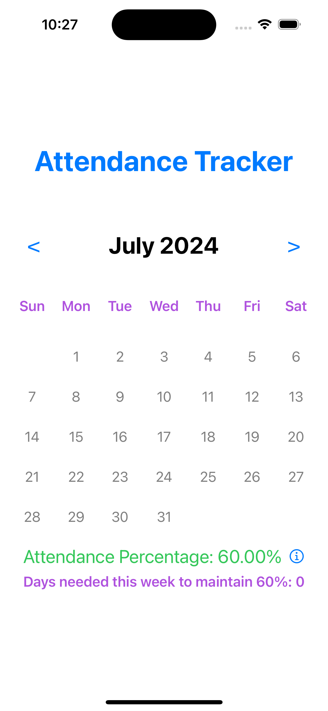

# Attendance Tracker

A sleek and efficient attendance tracking app designed to simplify tracking and viewing attendance records for the last 12 weeks. The app is developed using SwiftUI, providing a seamless user experience across iOS devices.

## Features

- **Weekly Attendance Overview**: Track attendance from Monday to Friday, up to 12 weeks.
- **Visual Summaries**: Easy-to-read visual summary with colored indicators.
- **Detailed Insights**: View percentage attendance with tooltips for additional details.
- **User-Friendly Design**: Intuitive UI design tailored for quick navigation.

## Screenshots

| Main Screen | Selection Screen | Attendance Summary |
|-------------|--------------------|----------|
|  |  |  |

## Getting Started

Follow these instructions to get a copy of the project up and running on your local machine.

### Prerequisites

- **Xcode** (version 12 or later)
- **Swift 5.0** or later

### Installation

1. **Clone the Repository**:
   ```bash
   git clone https://github.com/your-username/attendance-tracker.git
   cd attendance-tracker
   ```
2.	**Open in Xcode**:
   ```bash
	Double-click on AttendanceTracker.xcodeproj to open the project in Xcode.
   ```
3.	**Install Dependencies**:
   ```bash
	If you are using any dependencies, make sure to install them (e.g., via CocoaPods or Swift Package Manager). 
   ```
4.	**Build and Run**:
   ```bash
	Select your target device (simulator or a connected device) and click the Run button.
   ```

### Usage

1.	**Adding Attendance**:
	-	Open the app and select the desired date range.
	-	Mark attendance status for each day by selecting the appropriate options.
2.	**Viewing Summary**:
	-	Tap on the summary icon to view detailed attendance percentages and summaries.
3.	**Selecting Option**:
	-	Customize attendance tracking accordingly by selecting the right options.

### Customizing the App Icon

**If you wish to customize the app icon**:
   ```bash
	1.	Go to Assets.xcassets in Xcode.
	2.	Replace the placeholder icons with your custom icon images.
   ```
### Contact

**For more information, feel free to reach out**:
   ```bash
	•	Email: pranavnithesh@gmail.com
	•	LinkedIn: [Click Here](linkedin.com/in/pranavnithesh)
   ```


